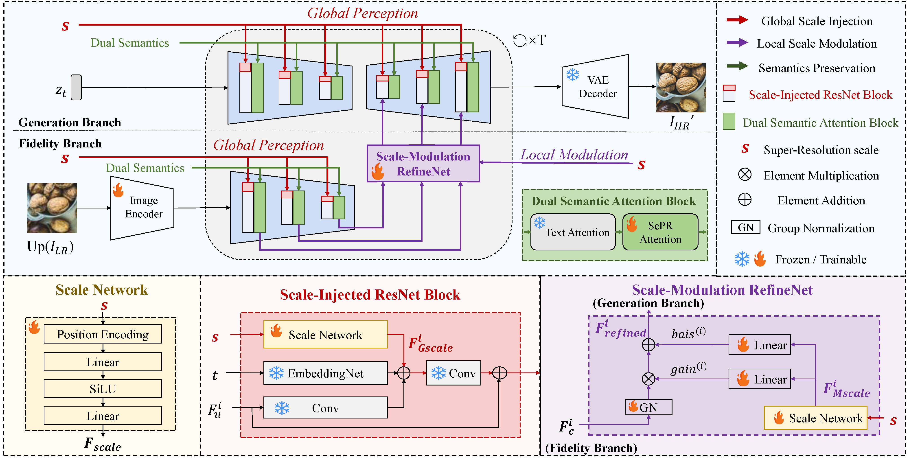

## OmniScaleSR: Unleashing Scale-Controlled Diffusion Prior for Faithful and Realistic Arbitrary-Scale Image Super-Resolution (TCSVT2025) 
<a href='https://arxiv.org/pdf/2512.04699'></a> &nbsp;&nbsp;

---

## 🔎 Overview framework


## ⚙️ Dependencies and Installation
```
## git clone this repository
git clone https://github.com/chaixinning/OmniScaleSR.git
cd OmniScaleSR

# create an environment
conda create -n omniscalesr python=3.10
conda activate omniscalesr
pip install -r requirements.txt
```
## 🚀 Quick Inference
#### Step 1: Download the pretrained models
- Download the pretrained SD-2-base models from [HuggingFace](https://huggingface.co/stabilityai/stable-diffusion-2-base) or [GoogleDrive](https://drive.google.com/drive/folders/1LVSwWbjJdn5Wxy79AwV5LdPX2S2Hotx1).
- Download the OmniScaleSR models from [GoogleDrive](https://drive.google.com/drive/folders/17LoKxcOCLuUYLggeZoo0Frv3YK9XQFfr).
- Download the pre-x4 model from [GoogleDrive](https://drive.google.com/drive/folders/1qaGi2Oi1GsgFb2T5BoBU5GCWsHicrQLK) and then rename it to 'seemoredetail_4x.pth'
- Download the RAM model from [HuggingFace](https://huggingface.co/spaces/xinyu1205/recognize-anything/tree/main)
- Download the DAPE model from [GoogleDrive](https://drive.google.com/drive/folders/12HXrRGEXUAnmHRaf0bIn-S8XSK4Ku0JO?usp=drive_link)

You can put the models into `preset/models`.
#### Step 2: Prepare testing data
You can put the testing images in the `input_images`.


#### Step 3: Running testing command
```
# x16 SR
CUDA_VISIBLE_DEVICES=4 python test_omniscalesr.py \
--upscale 16 \
--pretrained_model_path 'xxx/stable-diffusion-2-base/' \
--omniscalesr_model_path 'xxx/OmniScaleSR/' \
--ram_ft_path 'xxx/DAPE.pth' \
--image_path ./input_images \
--output_dir ./output_images/x16 \
--start_point noise \
--num_inference_steps 50 \
--guidance_scale 7.5 \
--process_size 512
```

You can change the target SR scale by modifying the parameter 'upscale'

## 🌈 Train 
#### Step1: Download the pretrained models
- Download the pretrained [SD-2-base models](https://huggingface.co/stabilityai/stable-diffusion-2-base).
- Download the DAPE model from [GoogleDrive](https://drive.google.com/drive/folders/12HXrRGEXUAnmHRaf0bIn-S8XSK4Ku0JO?usp=drive_link)

#### Step2: Prepare real-world ASSR training data
(1) Generate LR images:
```
python utils_data/make_paired_data_ASRealSR.py \
--gt_path  PATH1 \
--save_dir 'ASRealSR_data/PATH_1' \
--epoch 2
```
- --gt_path the path of gt images. e.g., xxx/LSDIR
- --save_dir the path of paired images
- --epoch the number of epoch you want to make

Arbitrary-resolution degradation is performed on-the-fly in the dataloader during training, ensuring that all images within each mini-batch have a consistent spatial resolution.

(2) Generate image captions:
```
# Step2-2 generate image captions using BLIP-2
python utils_data/BLIP2_generation_ASRealSR.py --start_gpu 0 --all_gpu 1
```

#### Step3: Training for OmniScaleSR
CUDA_VISIBLE_DEVICES="1" accelerate launch --num_processes 1 \
--main_process_port 10000 train_omniscalesr.py \
--pretrained_model_name_or_path="xxx/stable-diffusion-2-base/" \
--ram_ft_path 'xxx/DAPE.pth' \
--enable_xformers_memory_efficient_attention \
--mixed_precision="fp16" \
--resolution=512 \
--learning_rate=5e-5 \
--train_batch_size=1 \
--gradient_accumulation_steps=2 \
--null_text_ratio=0.5 \
--dataloader_num_workers=0 \
--checkpointing_steps=20000 \
--data_root TRAIN_DATA_ROOT \
--output_dir='./checkpoints' \
--max_train_steps 160000

## Acknowledgments
This project is based on [diffusers](https://github.com/huggingface/diffusers) and [BasicSR](https://github.com/XPixelGroup/BasicSR). Some codes are brought from [SeeSR](https://github.com/cswry/SeeSR) and [SeemoRe](https://github.com/eduardzamfir/seemoredetails). Thanks for their awesome works. 

## Contact
If you have any questions, please feel free to contact: `chaixinning@sjtu.edu.cn`

## 🎓Citations
If our code helps your research or work, please consider citing our paper.
The following are BibTeX references:

```
@ARTICLE{chai2025omniscalesr,
  author={Chai, Xinning and Cheng, Zhengxue and Zhang, Yuhong and Zhang, Hengsheng and Qin, Yingsheng and Yang, Yucai and Xie, Rong and Song, Li},
  journal={IEEE Transactions on Circuits and Systems for Video Technology}, 
  title={OmniScaleSR: Unleashing Scale-Controlled Diffusion Prior for Faithful and Realistic Arbitrary-Scale Image Super-Resolution}, 
  year={2025},
  volume={},
  number={},
  pages={1-1},
  doi={10.1109/TCSVT.2025.3642578}}

```
